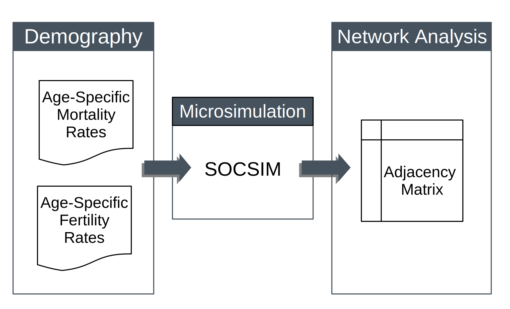

# dem_networks
This is a project repository for the study "Alive and Connected: A Microsimulation Approach to Translate Demographic Data into Family Network Data" presented (in poster form) at PAA 2017. The study authors are [__Pil H. Chung__](http://www.paulchung.org) and __Robert Pickett__.

# Motivation
The purpose of this study is to showcase a data translation procedure that takes aggregate demographic rate inputs (e.g. life tables and central fertility rate schedules) and generates the implied kinship network data using a microsimulation technique.

# Data
There are two RData files included here:
1. black_2000.RData
2. white_2000.RData
These are the raw outputs from the SOCSIM microsimulator. These Rdata objects contain a list of XX datasets (one for each simulation run). Each dataset contains 

# Reproduction

Place these files into your working directory and load them into your R environment:

~~~
load()
~~~

# The SOCSIM Microsimulator
