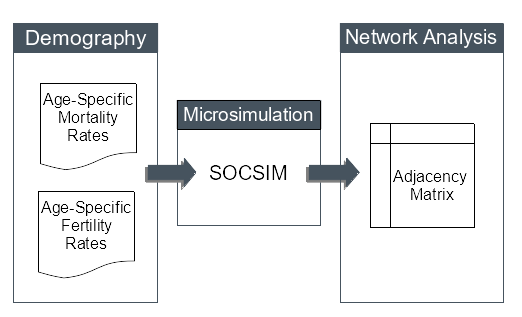

# dem_networks
This is a project repository for the study "Alive and Connected: A Microsimulation Approach to Translate Demographic Data into Family Network Data" presented (in poster form) at PAA 2017. The study authors are [__Pil H. Chung__](http://www.paulchung.org) and __Robert Pickett__.

# Motivation
The purpose of this study is to showcase a data translation procedure that takes aggregate demographic rate inputs (e.g. life tables and central fertility rate schedules) and generates the implied kinship network data using a microsimulation technique.

# Data
There are two RData files included here:

1. black_2000.RData
2. white_2000.RData

These are the raw outputs from the SOCSIM microsimulator for black and white populations with demographic inputs for the year 2000. These RData objects contain a list of 10 datasets (one for each replicate simulation run). Each dataset contains information on the following characteristics of each simulated individual:

| Variable Name   | Description               |
| --------------- | -----------               |
| caseid          | person ID number          |
| dob             | date of birth             |
| dod             | date of death             |
| mom             | mother's ID               |
| pop             | father's ID               |
| mate            | partner's ID              |
| mom_mom         | maternal grandmother's ID |
| mom_pop         | maternal grandfather's ID |
| pop_mom         | paternal grandmother's ID |
| pop_pop         | paternal grandfather's ID |

# Reproduction
All the code necessary to recreate the network data and results from the RData files are included in the "TITLE.R" R script file. 

# The SOCSIM Microsimulator
Additional information regarding SOCSIM, the microsimulator used in this demonstration, can be found at: <http://lab.demog.berkeley.edu/socsim>